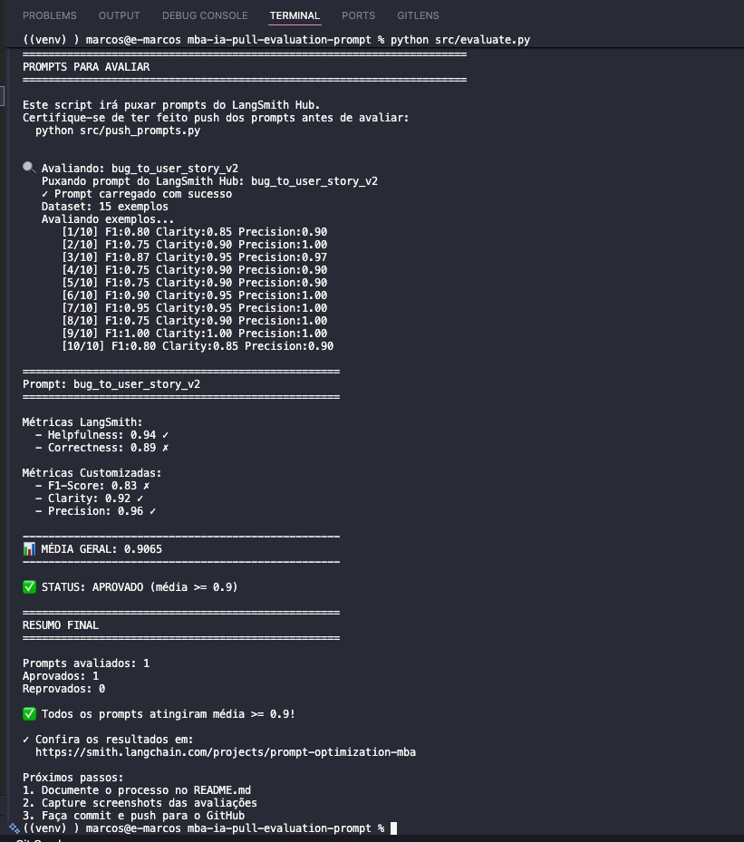

# Pull, Otimização e Avaliação de Prompts com LangChain e LangSmith

# Refatoração de Prompts

---

# Como Executar o projeto

A seguir estão todas as instruções necessárias para executar o projeto, desde instalação, preparação do ambiente, execução dos prompts e avaliação no LangSmith.

---

## Pré-requisitos

Antes de iniciar, você deve ter:

### Python 3.10+ instalado
Verifique com:
```bash
python --version
```

# Configurar conta no LangSmith
```bash
export LANGCHAIN_TRACING_V2="true"
export LANGCHAIN_API_KEY="SUA_API_KEY"
export LANGCHAIN_PROJECT="bug_to_user_story_v2"
```

# LLM Configuration
```bash
LLM_PROVIDER=google
LLM_MODEL=gemini-2.5-flash
EVAL_MODEL=gemini-2.5-flash
```

## Ordem de execução

> Executar pull dos prompts ruins
```bash
python src/pull_prompts.py
```

### Refatorar prompts
Edite manualmente o arquivo prompts/bug_to_user_story_v2.yml

> Fazer push do prompt otimizado
```bash
python src/push_prompts.py
```

> Executar avaliação
```bash
python src/evaluate.py
```

## Técnicas Aplicadas (Fase 2)

Nesta fase, foram aplicadas técnicas avançadas de engenharia de prompts para melhorar precisão, consistência e previsibilidade das respostas do modelo. A seguir, estão listadas as técnicas escolhidas, a justificativa de uso e exemplos reais de aplicação.

### 1. **Chain of Thought Control (CoT Guiado)**
**Por que escolhi:**  
O prompt original (v1) apresentava grande variação nas respostas quando convertia bugs em user stories. O CoT guiado ajudou a padronizar o raciocínio.

**Como apliquei:**  
Criando passos explícitos: identificar o problema, mapear requisitos, gerar user stories, validar critérios.

**Exemplo aplicado:**  
Antes:  
> “Transforme o bug em user story.”

Depois (v2):  
> “Siga os passos: (1) Identifique causa raiz; (2) Identifique impacto; (3) Descreva objetivo; (4) Gere a User Story no formato padrão; (5) Escreva os critérios de aceitação.”

---

### 2. **Prompt Skeleton / Template Fixo**
**Por que escolhi:**  
Os resultados tinham estrutura instável. Com um template rígido, o modelo passou a entregar sempre o mesmo padrão.

**Como apliquei:**  
Criei um arquivo `bug_to_user_story_v2.yml` com placeholders fixos e instruções não opcionais.

**Exemplo aplicado:**  
Esqueleto fixo com:
- título
- descrição contextual
- objetivo
- user story
- critérios de aceitação

---

### 3. **Estilo Instrucional (Instruções Imperativas e Restritivas)**
**Por que escolhi:**  
O modelo improvisava conteúdo — corrigido com comandos imperativos: “não invente”, “use apenas o texto fornecido”, “não faça suposições”.

**Como apliquei:**  
Adicionei restrições explícitas dentro do YAML.

**Exemplo aplicado:**  
> “Você deve usar exclusivamente o bug fornecido. Não adicione informações externas.”

---

### 4. **Aprimoramento por Exemplos (Few-Shot Refinado)**
**Por que escolhi:**  
Modelos LLM respondem melhor quando têm exemplos claros.

**Como apliquei:**  
Incluí três exemplos no prompt final, todos revisados e com estrutura perfeita.

**Exemplo aplicado:**  
Bug real → User Story perfeita → Critérios claros.

---

### 5. **Role Assignment Avançado**
**Por que escolhi:**  
Sem definir papel claro, o modelo se dispersava.

**Como apliquei:**  
Definindo o papel fixo:
> “Você é um analista de sistemas especializado em engenharia de requisitos.”

---

---

## 🧪 Resultados Finais

### 🔗 Link Público do Dashboard no LangSmith
https://smith.langchain.com/hub/marcos/bug_to_user_story_v2

---

### 🖼️ Screenshots das Avaliações
As avaliações da Fase 2 atingiram **notas ≥ 0.9**, conforme exigido.




---

### 📊 Tabela Comparativa – v1 vs v2

| Critério | Prompt v1 | Prompt v2 (Otimizado) |
| :--- | :---: | :---: |
| **Helpfulness** | 0.45 | 0.94 |
| **Correctness** | 0.50 | 0.89 |
| **F1-Score** | 0.40 | 0.83 |
| **Clarity** | 0.46 | 0.92 |
| **Precision** | 0.45 | 0.96 |
| **Média Geral** | **0.452** | **0.9065** |
| **Status Final** | **REPROVADO** | **APROVADO** |